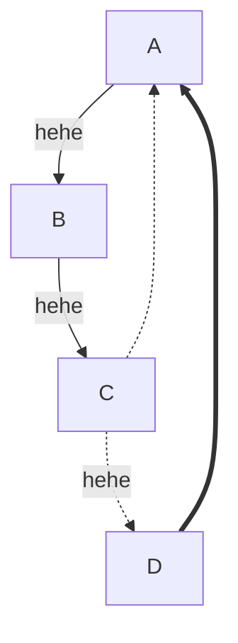

# Build Golang Game Server From Scratch

## Structure


## RabitMQ

## Message

### Http
1. login result
```proto
type LoginResult struct {
	Uid        string `json:"uid"`
	Score      int64  `json:"score"`
	Account    string `json:"account"`
	GameServer string `json:"game_server"`
}
```


### Header
| reserved | reserved |
| :--------: | :--------: |
|     YO     |     yo      |

## Reference
* [gorilla/websocket](https://github.com/gorilla/websocket)
* [funny/link](https://github.com/funny/link)
* [golang二进制协议接口映射](https://segmentfault.com/a/1190000008471015)
* [Go语言TCP Socket编程](https://tonybai.com/2015/11/17/tcp-programming-in-golang/)
* [Go语言TCP/IP网络编程](https://segmentfault.com/a/1190000014733620)
* [mermaidjs](https://mermaidjs.github.io/)