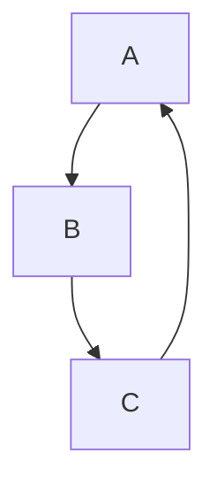

# Build Golang Game Server From Scratch

## Structure

## Reference
* [gorilla/websocket](https://github.com/gorilla/websocket)
* [funny/link](https://github.com/funny/link)
* [golang二进制协议接口映射](https://segmentfault.com/a/1190000008471015)
* [Go语言TCP Socket编程](https://tonybai.com/2015/11/17/tcp-programming-in-golang/)
* [Go语言TCP/IP网络编程](https://segmentfault.com/a/1190000014733620)